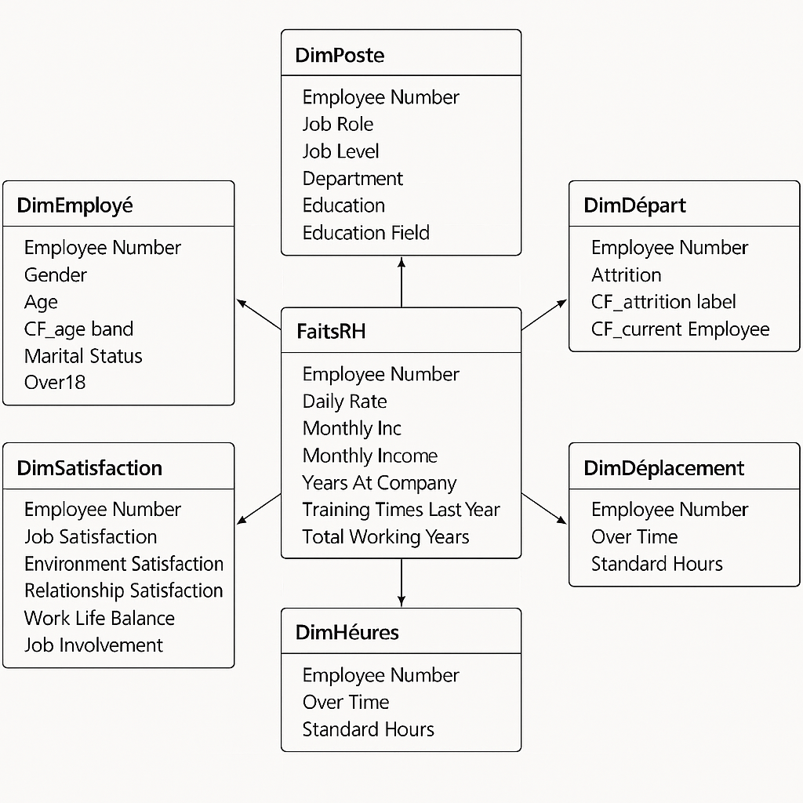

# Tableaux de bord Power BI

Trois tableaux de bord interactifs réalisés avec **Microsoft Power BI Desktop**, couvrant trois domaines métier : **ressources humaines**, **finance / ventes** et **gestion d'une salle de sport**.

| Fichier | Domaine | Modèle de données |
|---|---|---|
| `RH_Dash_board.pbix` | Ressources humaines | Schéma en étoile (`model_de_donnees_RH.png`) |
| `Financial_sample.pbix` | Ventes et profit | Table unique |
| `Suivi_cours_salle_de_sport.pbix` | Salle de sport | Table unique |

---

## 1. Dashboard RH — `RH_Dash_board.pbix`

Suivi de l'effectif, des salaires, de la satisfaction et de l'attrition (départs).

### Indicateurs

- Nombre total d'employés
- Nombre de départements
- Salaire mensuel moyen
- Note de performance moyenne
- Satisfaction au travail moyenne

### Visualisations

- Salaire moyen par **département**, par **poste** et par **niveau hiérarchique × genre**
- **Employés actifs et départs** par département
- Employés actifs par **domaine d'études** (anneau), par **niveau d'études × genre** et par **tranche d'âge × genre**
- Matrice de la **satisfaction** par poste et par niveau
- Filtres : **genre** et **situation familiale**

### Modèle de données

Schéma en étoile construit autour d'une table de faits :



| Table | Contenu |
|---|---|
| **FaitsRH** | Taux journalier, revenu mensuel, ancienneté, formations, années d'expérience |
| DimEmployé | Genre, âge, tranche d'âge, situation familiale |
| DimPoste | Poste, niveau, département, études |
| DimDépart | Attrition, statut de l'employé (actif / parti) |
| DimSatisfaction | Satisfaction (travail, environnement, relations), équilibre vie pro / vie perso, implication |
| DimHeures / DimDéplacement | Heures supplémentaires, heures standard |

Toutes les tables sont reliées par `Employee Number`.

---

## 2. Financial Sample Report — `Financial_sample.pbix`

Analyse des ventes et du profit à partir du jeu d'exemple **Financial Sample** de Microsoft.

- Cartes : nombre de pays, nombre de produits
- **Ventes et profit** par pays et par produit (tableau)
- Répartition des ventes par **pays** (graphique et **carte**)
- Répartition des ventes par **segment** (Government, Small Business, Enterprise…)
- **Évolution des ventes** dans le temps
- Filtres par **pays** et par **produit**

---

## 3. Suivi des cours en salle de sport — `Suivi_cours_salle_de_sport.pbix`

Suivi de l'activité et du chiffre d'affaires d'une salle de sport.

- Cartes : nombre total de séances, revenu total, nombre de membres, nombre de coachs
- Répartition des séances par **type d'exercice** et par **type d'abonnement**
- **Coach** ayant animé le plus de séances, par type d'abonnement
- Revenus par **type d'exercice × sexe** et par **type d'abonnement**
- Filtre par **année**
- Mesures DAX personnalisées (revenu par type, jour de la semaine…)

---

## Utilisation

1. Installer **[Power BI Desktop](https://powerbi.microsoft.com/desktop/)** (gratuit, Windows).
2. Ouvrir le fichier `.pbix` voulu.
3. Utiliser les segments (filtres) pour explorer les données ; tous les visuels se mettent à jour.

Les données sont **intégrées aux fichiers `.pbix`** : aucune source externe n'est nécessaire pour consulter les rapports.

---

## Structure

```
Power_BI-main/
├── RH_Dash_board.pbix
├── model_de_donnees_RH.png
├── Financial_sample.pbix
├── Suivi_cours_salle_de_sport.pbix
└── README.txt
```

---

## Compétences mises en œuvre

Modélisation en étoile · Power Query · mesures et colonnes calculées DAX · cartes KPI · segments · visuels cartographiques · conception de tableaux de bord

## Auteur

**Ryan Kounga Tchomnou** — [@KoungaRyan](https://github.com/KoungaRyan)
